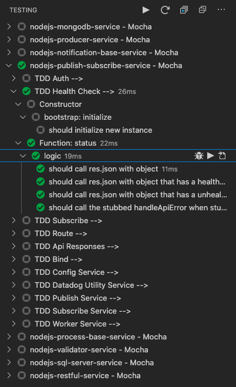

## TDD/BDD

All development environment TDD/BDD setup and usage. Link to testing [framework writeup](https://docs.google.com/document/d/1y8UpjEvaOc_WYhcexIdt-R0ApuvDKnupR6femHQQOOs/edit).

- [UI/JavaScript](#uijavascript)
- [NodeJS](#nodejs)
- [Python](#python)
- [PySpark](#pyspark)  
- [SQL](#sql)


### UI/JavaScript

Framework used in Algo UI/App and JavaScript is `mocha`.

### NodeJS

Framework used in all NodeJs services, API's or streams is `mocha`. This will be accompanied by `chai` and `sinon`. Utilizing `mocha` and these frameworks allows environment specific test case execution and jenkins integration.

-   [Mocha](https://mochajs.org/) is TDD/BDD framework test running that includes code coverage.
-   [Chai](https://www.chaijs.com/) is an assertion framework. ([Chai assertion styles](https://www.chaijs.com/guide/styles/))
-   [Chai as Promise](https://github.com/domenic/chai-as-promised) is an assertion framework to work with Promises.
-   [Sinon](https://sinonjs.org/) is a mocking framework for HTTP, sockets, streams and services.

#### Setup in NodeJS Project

To install all the testing frameworks in a new or existing NodeJS project follow the below steps.

-   `npm install --save-dev mocha`
-   `npm install --save-dev chai`
-   `npm install --save-dev chai-as-promised`
-   `npm install --save-dev sinon`
-   Create directory in root of repo named `test`
-   Create `tdd.js` file in `test` directory for all TDD cases using [TDD template](templates/tdd-bdd_nodejs-tdd.js)
-   Create `bdd.js` file in `test` directory for all BDD cases using [BDD template](templates/tdd-bdd_nodejs-bdd.js)
-   Open `package.json` file
-   Add

```JSON
  "scripts": {
    "test": "mocha",
    "coverage": "nyc mocha",
    "reporter": "nyc --reporter=lcov mocha"
  },
```

#### Visual Code Extension Setup

These instructions apply to Mac's only.

Within `Visual Code`:

-   Click `extensions` widget
-   Search `mocha`
-   Find [Mocha Test Explorer](https://marketplace.visualstudio.com/items?itemName=hbenl.vscode-mocha-test-adapter)
-   Click `Install` button
-   Search `code coverage`
-   Find [Code Coverage](https://marketplace.visualstudio.com/items?itemName=markis.code-coverage)
-   Click `Install` button

If project is typescript (Current):

-   Right click on project folder
-   Click `Open Folder Settings`
-   Search for `mochaExplorer.require`
-   Click `Edit in settings.json`
-   set `mochaExplorer.require` to `ts-node/register`

If project is typescript (Future):

-   Install `ts-node-register` to your `package.json` by running `npm install ts-node-register --save-dev`
-   create `.mocharc.json` file in root of directory:

```JSON
{
    "require": "ts-node/register"
}
```

#### Example

Under the Test tab



#### Note

If your project is not showing its test case.

-   Open the command panel.
-   type `Mocha Test Explorer`
-   find and click on the `Enable for workspace folder`
-   then select your project.

### Python

Framework used in all python services, or API's is `pytest`. Pytest by default supports writing test cases for TDD. Below are the some of the features of pytest. To learn more please use the followin framework links.

-   [Pytest](https://docs.pytest.org/en/latest/) has its own assertion support and does not required any new plugin.
-   [Pytest-cov](https://pytest-cov.readthedocs.io/en/latest/readme.html) provide various forms of code coverage and reports on the tests.
-   [Pytest-mock](https://pypi.org/project/pytest-mock/) is a plugin that provides mocking functionality for mocking other classes and functions.
-   [xdist](https://docs.pytest.org/en/3.0.0/xdist.html) is the plugin for parallel testing support. Parallel testing can be done by creating multiple subprocesses or using multiple machines.
-   [Pytest-bdd](https://pytest-bdd.readthedocs.io/en/stable/) is another plugin that adds BDD support for Pytest.

#### Setup in Python Project

To install all the testing frameworks in a new or existing Python projects follow the steps below. Use the existing virtual environments(for example: api_algo_env and api_algo_compute_env) used for algo developments to setup them for testing. Also, add the following packages to the `requirements.txt` file of the project.

-   `pip install pytest`
-   `pip install pytest-cov`
-   `pip install pytest-mock`
-   `pip install pytest-xdist`
-   `pip install pytest-bdd`

You need to make sure your environment parameters a being pulled in. Look into `python-dotenv` and `pytest-dotenv` to do this when local

-   Create a directory with the name `tests` in the root folder of the project.
-   If algo_api, use the existing tests folder inside the directory `algo_api`.
-   Inside the tests directory, create `bdd` and `tdd` directories.
-   Inside the tdd directory, create a file `conftest.py` to store common fixture functions used across different test files.
-   Create test files inside tdd as `test_tdd_path_to_script.py` for example `test_tdd_engine_extension_all_active_titles.py`(should have test classes for each function/class inside the **engine/extension/all_active_titles.py** script) using the [TDD template](templates/test_tdd_path_to_script.py).
-   Create a new file inside the tdd folder as `__init__.py` to make it a module.
-   Note: You don't have to import `conftest.py` in test files as it is handled by the framework.
-   The TDD test cases can be executed using the `vs code test explorer` or using `pytest` command in the project directory in terminal.
-   If running tests via terminal, you can run specific test functions/classes/modules using the -k flag along with the pytest command and add the function/class/module name to execute those tests(`ex: pytest -k test_return_data_with_no_parameters`).
-   Swtich to the bdd directory.
-   Create two new directories `features` and `step_defs` under `bdd`.
-   Create a file `feature_name.feature` for example `initial_ship_allocation_error.feature` inside the features folder using the [BDD feature file template](templates/feature_name.feature)
-   Inside the step_defs directory, create a file `conftest.py` to store common fixture.
-   Create test files in directory `step_defs` as `test_bdd_feature_name.py` for example `test_bdd_initial_ship_allocation_error.py` using the [BDD test file template](templates/test_bdd_feature_name.py).
-   The BDD test cases can be executed using the command `pytest path_to_the_bdd_test_file` or `pytest -k "tag name"`. The tage name is denoted by "@" operator at the top in the `.feature` file for the feature.
-   Here is how the directory structure should look like:

```
    > project_directory
        > tests
            > tdd
                > conftest.py
                > test_tdd_engine_extension_all_active_titles.py
            > bdd
                > features
                    > initial_ship_allocation_error.feature
                > step_defs
                    > conftest.py
                    > test_bdd_initial_ship_allocation_error.py
```

#### Visual Code Extension Setup

These instructions apply to Mac's only.

Within `Visual Code`:

-   Open Visual Studio Code and your workspace.
-   Click on the `extensions` widget on the left.
-   Search for `pytest`.
-   Find and install `Pytest IntelliSense`.
-   Find and install `Python Test Explorer for Visual Studio Code`.
-   Find and install `Pytest-snippets`. (optional)
-   Once the reload is completed, check for the test explorer widget after the extensions widget on the left(look for chemistry flask icon).
    
-   Click `Code` in top-left corner
-   Click `Preferences` > `Settings`
-   In the `User settings` tab click on the `file with an arrow` symbol on the top right `Open Settings (JSON)`.
-   In the settings file, copy and paste the following(make sure you replace the project folder and python installation path):

```JSON
{
    "python.testing.pyTestEnabled": true,
    "python.testing.unittestEnabled": false,
    "python.testing.nosetestsEnabled": false,
    "python.testing.pyTestPath": "pytest",
    "pythonTestExplorer.testFramework": "pytest",
}
```

-   In the settings menu, click on the `Folder settings` and select the folder you are settings up for writing test cases.
-   Click on the `{}` symbol on the top right to open the folder settings.
-   In the workspace tab, copy and paste the following(make sure you replace the project folder and python installation path - you can find the location of the python for your VE by typing `which python`):

```JSON
    "python.pythonPath": "<path to your environment python>",
    "python.testing.pyTestArgs": [
        "./<your project folder>/tests/",
	"-vv"
    ]
```

-   Save it and reload the `vs code`.
-   Open the terminal in vscode and switch to the output window. On the top right click on the dropdown menu and select `Python test log` and see if the tests are being discovered.
-   Save it and reload the `vs code`.
-   Switch to the test window by clicking the test icon on the extension panel on the left.
-   Once the test discovery is complete, if you are setting up for algo-api, you should be able to see something similar to:
    
-   The contents of the option vary depending on the state of the `tests` directiory inside `algo_api`.
-   Open one of those files and verify if the test functions and classes have the option to run them exclusively as shown below:
    

#### Test Coverage Report

To get a test coverage report, in terminal go to the project directory. Make sure the virtualenvironment is activated and then run `pytest --cov=project_directory_name/`. This returns the coverage report with detailed information on run time, failed cases, code coverage percentages per file and many other details. Please refer to the docs for more options on usage at [Pytest-cov](https://pytest-cov.readthedocs.io/en/latest/readme.html).

Here is an example on how it looks:


To make it easier to run the code coverage for all the tests in a repo, create a shell script in the project folder with name `test_coverage.sh` and add the following:

```BASH
#!/bin/bash
# Script to run pytest with code coverage and missing lines in the given path.
echo "Path to the source files: ${1:-.}"

pytest --cov-report=term --cov-branch --cov-config=.coveragerc --cov=${1:-.} tests/
```

-   Go to terminal and switch to the directory that has the shell script.
-   Type `chmod +x test_coverage.sh` in the terminal.
-   The shell script supports 1 argument which is a path to the specific directory that you want the coverage report for. By default, it provides the coverage report along with branch coverage for the project directory.
-   To execute the script, run `./test_coverage.sh` or `./test_coverage.sh path/to/the/foler`(Ex: `./test_coverage.sh engine/function` to get the coverage report for just the function folder in engine inside API).
-   To exclude the `tests` folder in the coverag report, create a file with the name `.coveragerc` in the project folder(if API-ALGO use the algo_api folder and not the root) and add the following to the file.

```INI
[run]
omit = tests/*
```

-   Save the file and now rerun the coverage shell script and verify if the tests directory is excluded from the result.

### PySpark

Framework used in all pyspark jobs is `pytest-spark`.

### SQL

This is to be determined.